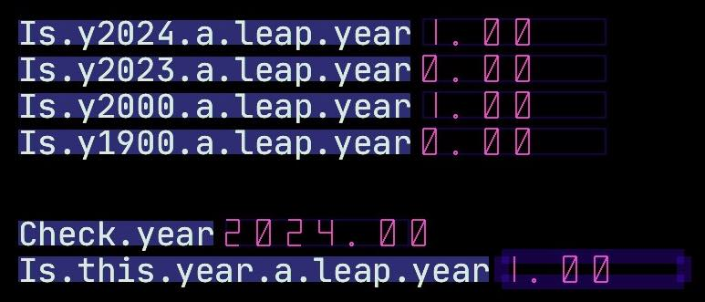

# Leap Year code in ACPUL

This folder contains code in ACPUL [acpul.org](https://acpul.org/) to determine whether a year is a leap year.

NOTE: Use Python syntax highlighting for ACPUL in Sublime Text or Markdown.

## Running tests from CLI

To run test from CLI just use `acpul` interpreter with `-i <path>` for the source directory and `-e <formulaId>` with the number of the formula to execute:
```sh
acpul -i . -e 20241000
```

## Running tests inside ACPU

Just copy the file to the ACPU project directory and create a new formula node in the bootloader:
```py
# Create by formula number
node.new.this.ex(r0, 20241001, 0);
# Or create by formula name
node.new.this.ex(r0, NNN(eternal.hacktoberfest.test), 0);
```


