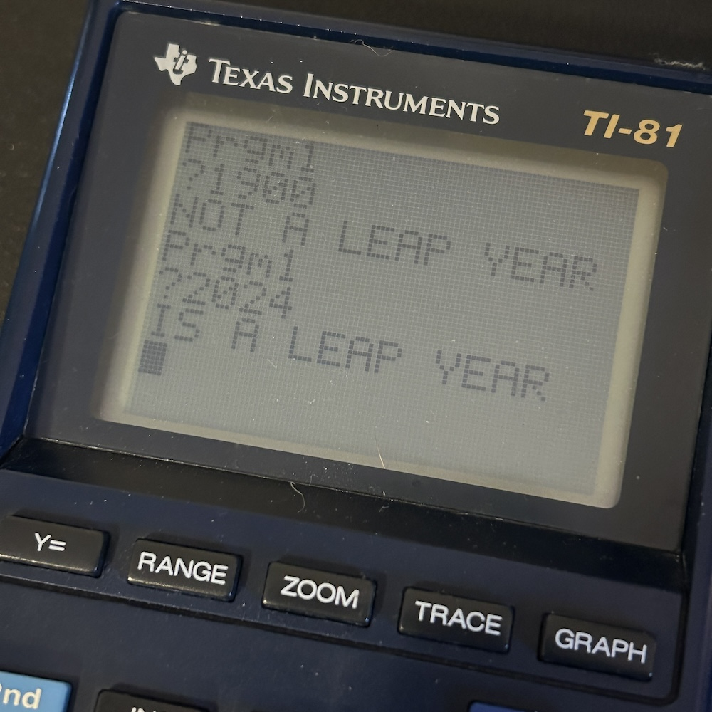

# Leap Year code in TI-BASIC

This folder contains leap year code snippets for TI-BASIC.

# TI-81

The code in `leap-year.txt` was written and test on a TI-81 calculator.

This device has no method of external input, so it needs to be entered manually into a program slot.

Sample interaction and output:

```
Prgm1
?1900
NOT A LEAP YEAR
Prgm1
?2024
IS A LEAP YEAR
```


